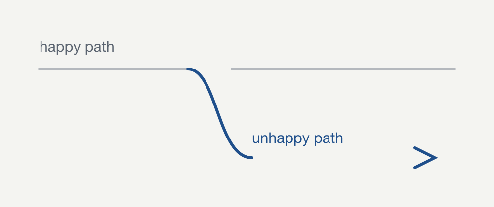

<!-- TODO(oded): STUB POST — this exists only to verify the reading layout. Delete it,
     along with diagram.png and its block in scripts/render-assets.mjs. -->

This post exists to prove the layout survives real content. If everything below
reads well in both light and dark mode, the design works.

## Headings, emphasis and links

A second-level heading sits above. Text can be **bold**, _italic_, `inline code`,
or a [link to another page](/notes). Line length is capped at about 68
characters so long paragraphs stay readable — which is the entire point of the
measure, and the reason this paragraph runs on a little.

### A third-level heading

Lists work as expected:

- A bullet
- Another bullet, with a [link](https://github.com/omesser)
- A third

1. Ordered
2. Also ordered

## Images

Images live next to the post that uses them and are optimized at build time —
no manual resizing, no CDN:



## Code

```python
def process(record):
    """The happy path is four lines. The rest is the unhappy path."""
    if not record:
        raise ValueError("empty record")
    return record["value"] * 2
```

## Quotes and tables

> Everything fails all the time.
>
> — Werner Vogels

| Path    | Designed for | Tested |
| ------- | ------------ | ------ |
| happy   | the demo     | always |
| unhappy | production   | rarely |

## Embedded media

Raw HTML passes straight through, so an embed needs no plugin:

<iframe src="https://www.youtube-nocookie.com/embed/aqz-KE-bpKQ" title="Big Buck Bunny" loading="lazy" allowfullscreen></iframe>

---

That is the whole surface. Nothing here needs MDX.
